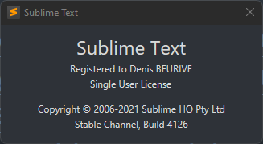

# Good Software

## Security

* [Keepassxc](https://keepassxc.org/): highly recommended!
* [Authy](https://authy.com/): highly recommended!
* [KeyBase](https://keybase.io/)
* [CryptoMator](https://cryptomator.org/)
* [AxCrypt](https://www.axantum.com/)

## Productivity

* [GreenShot](https://getgreenshot.org/): highly recommended!
* [Yed](https://www.yworks.com/products/yed): highly recommended!
* [Pandoc](https://pandoc.org/): highly recommended!
* [PDF Pro](https://www.pdfpro10.com/)
* [WinRar](https://www.win-rar.com/): highly recommended!
* [MobaXterm](https://mobaxterm.mobatek.net/): highly recommended!
* [Markdown here](https://markdown-here.com/) (plugin for FireFox)
* [Dark reader](https://darkreader.org/) (plugin for FireFox)
* [TLDR](https://tldr.sh/)
* [btop](https://github.com/aristocratos/btop)
* [BitVise SSH client](https://www.bitvise.com/ssh-client)

## Techcnical

* [GraphViz](https://graphviz.org/): highly recommended!
* [PovRay](https://www.povray.org/): highly recommended!

## Development

* [Gitea](https://gitea.io/en-us/)
* [Cypress](https://www.cypress.io/)
* [Sublime merge](https://www.sublimemerge.com/): highly recommended!
* [Sublime text](https://www.sublimetext.com/)
* [BashSupport Pro for JetBrains](https://plugins.jetbrains.com/plugin/13841-bashsupport-pro)
* [Perl for JetBrains](https://plugins.jetbrains.com/plugin/7796-perl) highly recommended!
* [ClangFormat](https://clang.llvm.org/docs/ClangFormat.html): highly recommended! It is used to homogenize the formatting of the code.
* [HeidiSQL](https://www.heidisql.com/download.php?download=installer): pretty good Windows client for MariaDB.

## Notes

### Sublime text

Version:



The documentation for installing a plugin is not accurate.

Intalling a plugin:

Install "Package Control": `Tools` => `Install Package Control...`. Once installed, you should see 2 new entries in the `Preferences` menu: `Browse Packages...` (at the top) and `Package Control` (at the bottom).

* `Preferences` => `Browse Packages...`: opens an explorer to the directory that contains all packages sources.
* `Preferences` => `Package Control`: an interactive tool that lets you manage packages.

To install a package, you can use the interactive tool accessible from the menu `Preferences` => `Package Control`.

Or you can perform a manual installation that consists of:

**STEP 1** Clone the Git repository that contains the sources of the package in the Sublime Text package directory. To get the path to this directory, just click on the menu entry `Preferences` => `Browse Packages...` (it open an explorer to the directory).

**STEP 2** Declare the (previously) "cloned" repository as containing a Sublime Text package. To do that, click on `Preferences` => `Package Settings` => `Package Control` => `Settings`. Then, add the name of the new package into the JSON structure below :

```json
{
	"bootstrapped": true,
	"installed_packages":
	[
		"Package Control",
		"Path Tools"
	],
}
```

Here, I've just declared the package "Path Tools".

**STEP 3** Restart Sublime Text.

